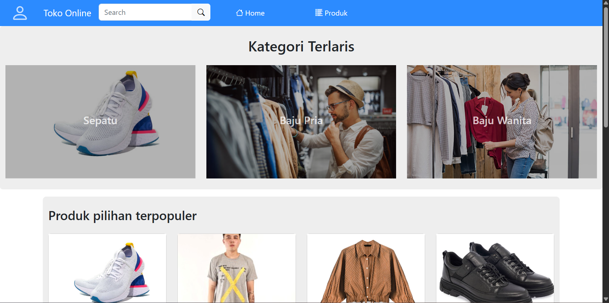
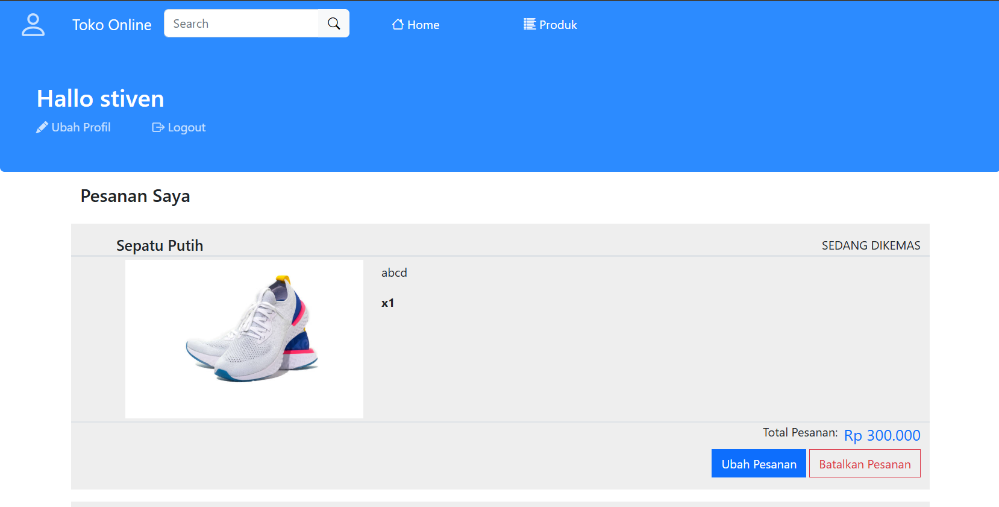
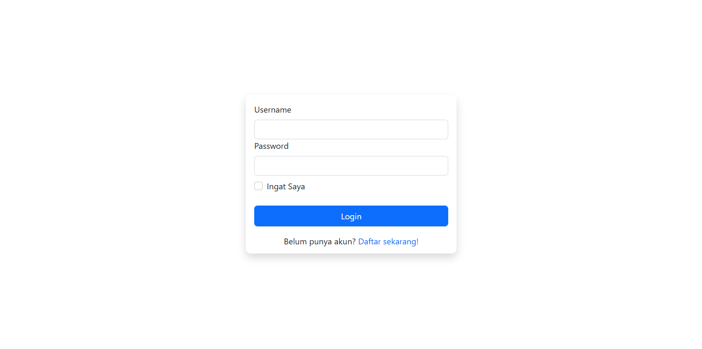
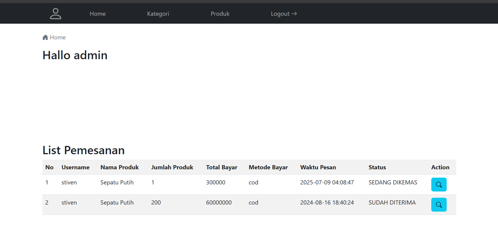

# 🛒 Aplikasi Web Penjualan Produk

**simulasi toko online** yang memungkinkan pengguna untuk melihat produk, melakukan pemesanan, serta admin bisa mengelola data melalui admin panel.

---

## 🚀 Fitur Aplikasi

### 👤 Fitur Pengguna

- Registrasi dan login
- Login otomatis dengan cookie "Ingat Saya"
- Lihat daftar produk
- Lakukan pemesanan produk
- Lihat dan ubah status pesanan
- Edit profil dan password

### 🛠️ Fitur Admin Panel

- Login admin terpisah
- Dashboard admin (jumlah produk, kategori, pemesanan)
- Tambah, ubah, dan hapus kategori
- Tambah, ubah, dan hapus produk (dengan upload gambar)
- Konfirmasi dan update status pemesanan

---

## 🧰 Teknologi yang Digunakan

| Komponen | Teknologi                    |
| -------- | ---------------------------- |
| Backend  | PHP Native                   |
| Frontend | HTML5, CSS, Bootstrap 5, JS |
| Database | MySQL                        |
| Auth     | Session & Cookie             |
| Tools    | XAMPP              
---

---

## 🏠 Beranda (Produk)

## 📥 Pemesanan Saya

## 🔐 Login Pengguna

## 👤 Admin Dashboard

